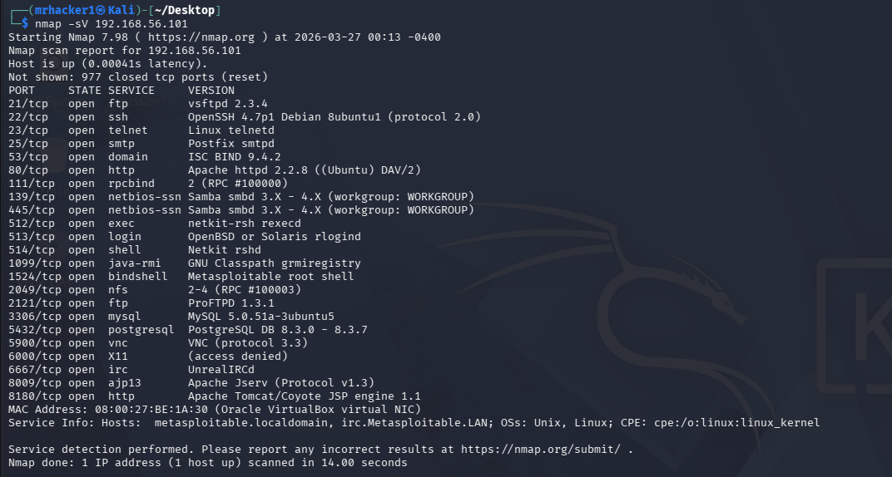
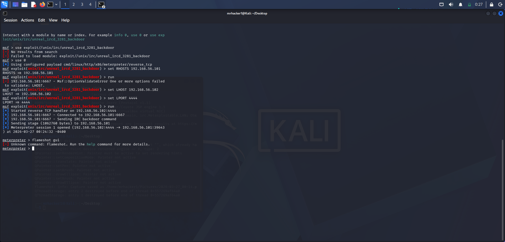
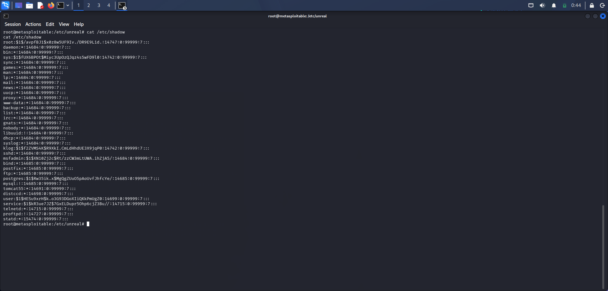
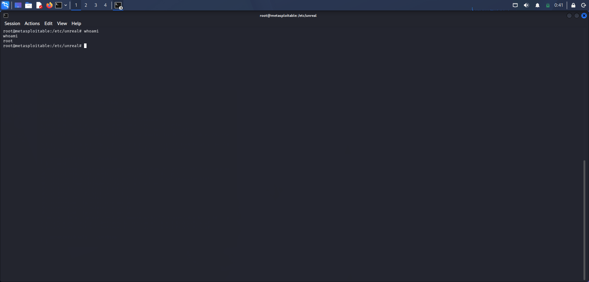

# vulnerability-exploitation- testing

## Overview
This project demonstrates a full penetration testing workflow conducted in a controlled lab enviroment using Kali Linux and Metasploitable 2.

The objective was to:
-Identify vulnerabilities
-Exploit services
-Gain root access
-Perform post-exploitation analysis

---

## Tools Used
-Kali Linux
- Metasploitable 2
- Nmap
- Metasploit Framework

---

## Lab Setup
- VirtualBox enviroment
- Host-only network configuration
- Attacker: Kali Linux
- Target: Metasploitable 2

---

## Reconnaissance

Performed service and version detection using:

	nmap -sV 192.168.56.101

## Exploitation

Used Metasploit to exploit vulnerabilities.

## Credential Access
-Dumped password hashes from the target machine

## Privilege Escalation

-Successfully gained root access on the target

## Key Findings

- Multiple outdated services
- Weak credentials
- Vulnerable configurations

## Lessons Learned

- Importance of proper patching
- Network segmentation matters
- Always secure default credentials

## Disclaimer

This project was conducted in a controlled lab environment for educational purposes only.
